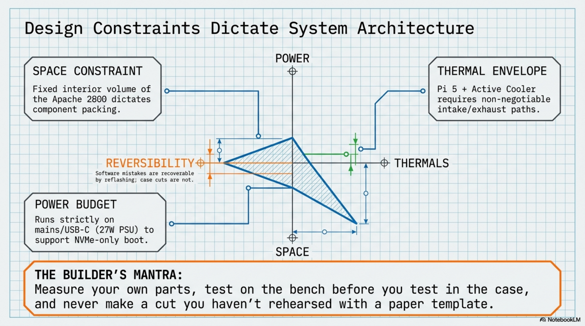

# Chapter 1: Planning & Scope

**Learning objectives:** Define what this machine is for, translate that into concrete design constraints, and set up a project-tracking system that survives the whole build.  
**Tools & materials:** Notebook or note-taking app; nothing physical required yet.  
**Estimated time:** 1–2 hours

*Plate 2, Chapter 1: Planning & Scope*

## 1.1 Project Objectives

The stated purpose of this build is a portable Linux general-purpose workstation — software development (Docker-based workflows, Git, SSH, scripting, and application development across whatever languages and frameworks the builder actually uses), lightweight local AI experimentation, systems administration, and everyday general computing. Every design decision in this manual is weighed against that broad, general-purpose purpose — this is why the manual consistently favors keyboard quality, thermal headroom, and serviceability over thinness or minimum weight, and why nothing in the hardware or software chapters is tied to a single framework, project, or use case.

## 1.2 Use Cases

- Primary: a self-contained, general-purpose computing station usable at a desk or on the road without a laptop — software development, systems administration, and everyday computing alike
- Secondary: a portable SSH/administration terminal for managing remote servers or homelab equipment
- Tertiary: a lightweight local AI experimentation rig, bounded by the Pi 5's compute envelope — not a substitute for GPU-class inference, but sufficient for small models and general framework development
- Quaternary: a general-purpose Linux desktop for everyday tasks — browsing, document editing, note-taking, and media — whenever it isn't being used as a dev or admin station

## 1.3 Design Constraints

| Constraint | Driven by | Implication for the build |
|---|---|---|
| Fixed enclosure volume | Apache 2800 interior | Every component placement is a packing problem — plan airflow and cable paths before cutting |
| Fixed compute thermal | Pi 5 + Active Cooler | Fan intake/exhaust paths are non-negotiable design constraints, not |
| envelope |  | afterthoughts |
| No battery in baseline build | Locked hardware spec | Mains/USB-C power only for V1; battery is a Chapter 13 upgrade path |
| Reversibility of software, | NVMe boot design | Software mistakes are recoverable by reflashing; case cuts are not — |
| not hardware |  | this asymmetry drives the chapter order |

## 1.4 Tradeoff Analysis

The two tradeoffs worth naming explicitly before you start: keyboard feel versus footprint (the Huntsman Mini's 60% layout trades away a numpad and function row for a compact chassis that fits inside a rugged case), and cooling versus sealing (any enclosure that fully seals against dust also restricts airflow — this build accepts some open venting as the better tradeoff for a device that will run sustained development workloads).

## 1.5 Success Criteria

- Boots reliably from NVMe with no external storage
- Sustains a full development session (editor, containers, terminal multiplexer) without thermal throttling
- Survives normal transport (closed lid, bag carry) without cable stress or component shift
- Can be opened for maintenance without destructive disassembly

## 1.6 Project Milestones

| Milestone | Chapters | Gate before proceeding |
|---|---|---|
| Bench-validated compute core | 2–3 | Boots from NVMe, passes stress test, no throttling |
| Confirmed-fit enclosure plan | 4 | Paper templates close cleanly in the case |
| Cut and finished enclosure | 5 | Display test-fits the opening with no pinching |
| Fully assembled hardware | 6–8 | Passes the one-hour operational test |
| Working software environment | 9–10 | Full dev workflow verified end-to-end |
| Field-ready device | 11 | Passes acceptance criteria under real use |

## 1.7 Build Journal Template

Use this structure for every entry in your build journal (paper or digital):

- Date and chapter/section reference
- What you measured (with the actual number, tool used, and which part revision)
- What you changed from the plan, and why
- Photo reference (filename or description)
- Open questions / things to verify before the next irreversible step

## 1.8 Risk Register

| Risk | Likelihood | Mitigation |
|---|---|---|
| Cut opening too large for display | Medium | Paper template dry-fit in Ch.4 before any plastic is cut |
| Insufficient airflow causes throttling | Medium | Bench stress-test in Ch.2, re-test assembled in Ch.8/11 |
| Cable fatigue at hinge over time | Medium–High with heavy use | Deliberate service loop, inspected on the maintenance schedule (Ch.12) |
| NVMe SSD physical size mismatch | Low if checked | Confirm SSD form factor against HAT+ documentation before Ch.3 |
| with HAT+ tray | early |  |
| Case batch dimensions differ from | Medium | This manual never prints case dimensions as fact — always measure |
| expectation |  | your unit |

## 1.9 Capabilities & Potential

What the finished, general-purpose workstation can do out of the box, and what it opens the door to — deliberately spanning well beyond just coding:

**Software development & systems administration**

- Full Linux development environment: Git, Python, Docker, VS Code (Remote-SSH capable), and any language toolchain the builder installs — nothing in this manual is scoped to one framework or project
- Headless SSH operation as a portable server/administration terminal for remote systems or homelab equipment
- NVMe-only boot with a real desktop-class filesystem for reliable sustained I/O under builds, containers, and general use
- Lightweight local AI/ML experimentation — small models, framework development, inference testing — within the Pi 5's compute envelope

**General computing & productivity**

- A standard Linux desktop for everyday tasks: web browsing, document/spreadsheet editing, note-taking, PDF reading, and email — usable without ever opening a terminal
- A standalone touch-and-keyboard machine: 8″ capacitive touch display plus a real mechanical keyboard (Razer Huntsman Mini), so no external monitor or keyboard is required
- A portable media player/light editing box for photos, audio, and video review

**Networking, home lab, and IoT**

- A dedicated network diagnostics and administration console (monitoring, log review, config management) for home lab or small-office infrastructure
- A base station for home automation or IoT projects via the GPIO breakout upgrade path (Chapter 13.4), independent of any coding use case
- Sustained-load thermal headroom (Active Cooler + validated airflow path) that supports long-running background services, not just interactive sessions

**Education, maker projects & general reliability**

- A resilient, serviceable teaching or learning platform for Linux, electronics, or general computing fundamentals — fully documented and repairable (Chapter 6 fastener protocol, Chapter 12 maintenance schedule) rather than a sealed, disposable device
- A stable base for general maker/hobby electronics projects via the reserved expansion volume and GPIO access, unrelated to any specific software stack

**Potential / expansion paths** (see Chapter 13 for full detail)

- Untethered field use via an internal battery, using the volume and power routing already reserved for it (§4.6, §7.7)
- Expanded I/O through panel-mounted USB/Ethernet without touching the existing internal wiring
- Sensor and hobby-electronics experimentation via a GPIO breakout compatible with the M.2 HAT+
- Networked or cloud inference as a thin client, sidestepping the single-PCIe-lane conflict a local AI accelerator would create
- Presentation or external-display use — the Pi 5 carries a second micro-HDMI output physically on the board, unused in this baseline build, as a natural path to driving an external screen or projector
- Cosmetic and ergonomic refinement (custom bezels/labels, additional venting) once the functional build is validated

Cross-reference: Chapter 13 (Upgrade Paths) is the detailed roadmap for every item in the potential list above.

Chapter Summary

- The build's purpose (a general-purpose workstation, not limited to coding) should drive every design decision that follows.
- Design constraints and tradeoffs are fixed by the locked hardware spec and the Apache 2800's finite volume.
- A milestone gate system prevents moving to irreversible steps before validation.

Cross-references: See Chapter 4 for enclosure measurement methodology, Chapter 11 for acceptance testing against these success criteria.
