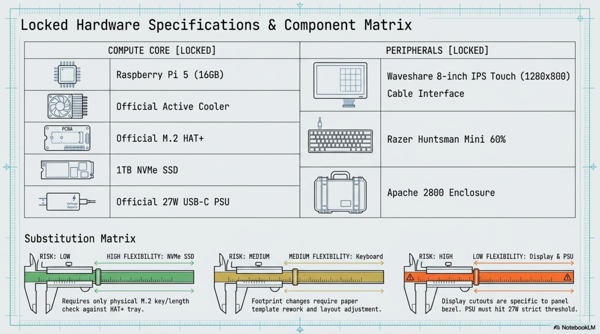

# Chapter 2: Tools & Bill of Materials

**Learning objectives:** Assemble a complete, correct toolkit and parts list before spending on anything, including a compatibility matrix for the few components with real substitution flexibility.  
**Tools & materials:** None yet — this chapter is the shopping/prep list itself.  
**Estimated time:** 1 hour research + procurement lead time

*Plate 3, Chapter 2: Tools & Bill of Materials*

## 2.1 Complete Tool Guide

| Tool | Purpose | Notes |
|---|---|---|
| Digital calipers | All fit-critical measurements | Non-negotiable — this build depends on measuring your own parts |
| Rotary tool + plastic-cutting bits | Display cutout and port cutouts | A sanding drum attachment is used for finishing |
| Drill + bit set (1.5–6 mm) | Starter holes, mounting holes | A step bit helps keep round holes centered |
| Needle files (flat + round) | Finishing cut edges | Round file is useful for corner radii |
| Small clamps | Securing the case during cutting | Never hand-hold a piece being cut |
| Painter's tape | Template transfer, chip protection | Also doubles as a low-tack marking surface |
| Vacuum / compressed air | Debris removal | Use before every test-fit, not just at the end |
| Anti-static mat or surface | Bench assembly of Pi/HAT/SSD | Reduces ESD risk to the board |

SAFETY: Eye protection is mandatory for every cutting and drilling step in this manual. Plastic chips travel further and faster than they look like they will.

## 2.2 Consumables

- Sandpaper, 220–400 grit
- Isopropyl alcohol + lint-free cloths (foam adhesive removal, dust wipe-down)
- Zip ties, 100–150 mm
- Adhesive cable-clip mounts
- Thread-locker (optional, for fasteners exposed to vibration if the deck sees frequent travel)

## 2.3 Locked Hardware Bill of Materials

| Category | Item | Qty | Notes |
|---|---|---|---|
| Case | Apache 2800 protective case | 1 | Foam removed; interior modified |
| Compute | Raspberry Pi 5, 16 GB RAM | 1 | Locked spec |
| Cooling | Official Raspberry Pi Active Cooler | 1 | Fits Pi 5 mounting holes |
| Storage interface | Official Raspberry Pi M.2 HAT+ | 1 | Mounts atop Pi 5 GPIO header |
| Storage | NVMe SSD, 1 TB, M.2 2230/2242/2280 | 1 | Confirm physical key/length fits HAT+ tray |
| Display | Waveshare 8″ IPS HDMI Capacitive Touch, 1280×800 | 1 | Confirm exact model revision (bezel dims vary) |
| Keyboard | Razer Huntsman Mini (60%) | 1 | USB-C detachable cable |
| Power | Official Raspberry Pi 27W USB-C PSU | 1 | Required for Pi 5 + NVMe + display power budget |
| Cabling | Short HDMI (Micro-HDMI to HDMI, ~15–20 cm) | 1+ | Length depends on final internal layout |
| Cabling | Short USB-A/USB-C cables as needed | 1+ | For keyboard, touch interface |
| Hardware | M2.5 / M3 standoffs (assorted lengths) | assorted | Exact lengths depend on case depth — measure |
| Hardware | M2.5 / M3 machine screws (assorted) | assorted | Match to standoffs and Pi/HAT mounting holes |

## 2.4 Alternative Parts & Compatibility Matrix

This build's hardware spec is locked, but if a substitution ever becomes necessary (discontinued part, regional availability), the compatibility considerations below apply:

| Component | Substitution flexibility | What must be verified if substituted |
|---|---|---|
| NVMe SSD | High — any Pi 5-compatible NVMe drive works | Physical M.2 size against HAT+ tray; power draw within PSU budget |
| Display | Low — cutout and mounting are display-specific | Any substitute requires re-measuring bezel and active area from scratch |
| Keyboard | Medium — any USB-C keyboard fits functionally | Footprint changes affect Chapter 6 layout and Chapter 4 templates |
| Component | Substitution flexibility                 W | hat must be verified if substituted |
| Power supply | Low — Pi 5 has a real minimum power      M delivery requirement                     2 | ust supply sufficient wattage for Pi 5 + NVMe + display; official 7W PSU is the tested baseline |

## 2.5 Cost Tiers & Procurement Checklist

Group purchases into three tiers so a delay on one item doesn't stall the whole build: Tier 1 (compute core — Pi 5, cooler, HAT+, SSD, PSU) can be fully bench-tested per Chapter 3 the moment it arrives, independent of the case. Tier 2 (case, display, keyboard) is needed starting Chapter 4. Tier 3 (small hardware — standoffs, screws, cable clips, zip ties) is cheap, easy to over-buy, and worth ordering an assortment of rather than a single guessed size.

- Confirm NVMe SSD form factor before ordering (check HAT+ tray spec)
- Order an assorted standoff/screw kit rather than a single length
- Order slightly-longer-than-estimated HDMI/USB cables — trim the routing plan, not the cable
- Verify display revision/model number against your specific retailer listing before ordering

Chapter Summary

- Tool list and consumables are gathered once, up front, to avoid mid-build shopping trips.
- The BOM is locked for this build; the compatibility matrix exists only for future substitutions.
- Procurement is tiered so compute-core bench testing (Chapter 3) can start before the case arrives.

Cross-references: See Chapter 4 for how case/display measurements feed back into final hardware choices.
