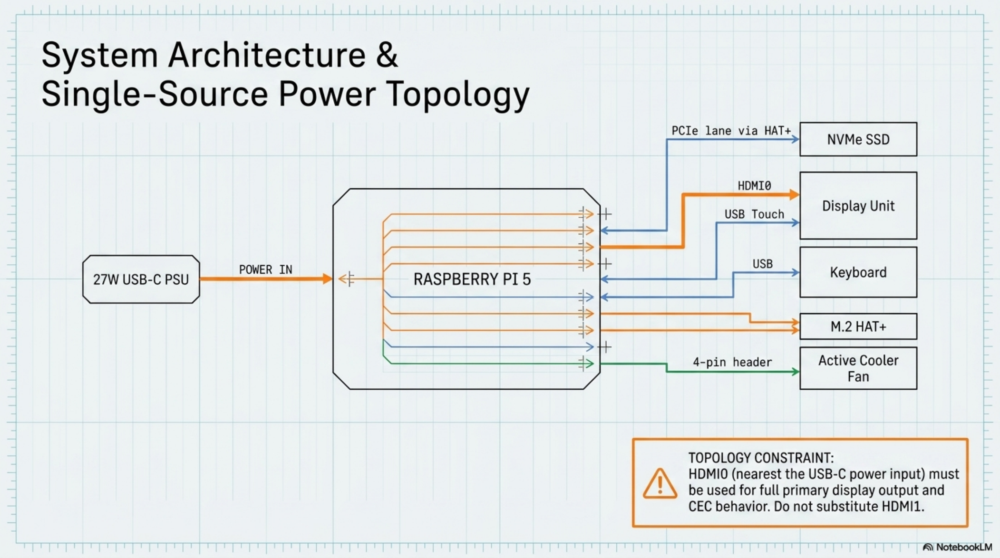

# Chapter 3: Raspberry Pi 5 Platform

**Learning objectives:** Understand the platform theory behind the Pi 5's power, thermal, and storage architecture well enough to diagnose problems, not just follow steps.  
**Tools & materials:** Anti-static surface, Pi 5, Active Cooler, M.2 HAT+, NVMe SSD, microSD card, keyboard/display/PSU for bench test.  
**Estimated time:** 3–4 hours including stress testing


*Plate 4, Chapter 3: Raspberry Pi 5 Platform*

## 3.1 Pi 5 Architecture Overview

The Raspberry Pi 5 is built around a quad-core Arm CPU with a dedicated PCIe 2.0 x1 interface exposed via the board's underside FPC connector — this is what the M.2 HAT+ uses to bridge to NVMe storage. Unlike earlier Pi generations, boot firmware (EEPROM) supports booting directly from PCIe-attached NVMe storage without SD card mediation, which is the entire basis for this build's storage design.

## 3.2 Power Delivery

The Pi 5 draws meaningfully more power than earlier boards, particularly under sustained CPU load with an NVMe drive and a full-size HDMI display attached. The official 27W USB-C PSU exists specifically to meet this combined budget with headroom; underpowered third-party supplies are a common source of under-voltage throttling that looks like a software or thermal problem but isn't.

| Load condition | Approximate draw behavior | Risk if underpowered |
|---|---|---|
| Idle, display attached | Lowest sustained draw | Low risk even on marginal supplies |
| Load condition | Approximate draw behavior | Risk if underpowered |
| Sustained CPU load (builds, containers) | Meaningfully higher, sustained | Under-voltage warnings, throttling |
| NVMe under heavy I/O + CPU load | Combined peak | Highest risk of under-voltage on non-official |
| simultaneously |  | supplies |

## 3.3 Thermals

The Active Cooler is a combined heatsink-and-fan assembly with spring-loaded pins that clip directly to the board's four mounting holes, and a thermal pad that contacts the SoC package. Fan speed is managed automatically by firmware based on measured SoC temperature — you do not need to configure a fan curve manually for baseline operation, though config.txt exposes fan control parameters for advanced tuning.

## 3.4 PCIe / NVMe Theory

The M.2 HAT+ exposes the Pi 5's single PCIe lane to a standard M.2 M-key NVMe slot. By default the Pi may negotiate a conservative PCIe generation for compatibility; Gen 3 speeds can be enabled explicitly in configuration once you've confirmed your specific SSD is on the community-tested compatibility list, trading a small compatibility risk for higher throughput.

## 3.5 EEPROM & Recovery

The Pi 5's bootloader lives in onboard EEPROM, independent of any SD card or SSD content — this is why updating it and confirming boot order is a firmware-level operation, not an OS-level one. If a boot ever fails after modification, the rpi-eeprom-update toolchain and a known-good recovery SD image are the standard recovery path.

## 3.6 Bench Validation

| Step | Action |
|---|---|
| 1. Assemble outside the case | Attach the Active Cooler, mount the HAT+ and SSD, and connect keyboard/display/PSU — all on the open bench. |
| 2. First boot from microSD | Boot a fresh Raspberry Pi OS (64-bit) install from microSD to get a known-good, updatable environment. |
| 3. Update firmware, enable NVMe | Run the EEPROM update and set boot order to include NVMe, per the commands in |
| boot | Section 3.7. |
| 4. Migrate to NVMe | Flash or clone the OS onto the NVMe SSD, remove the microSD card, and confirm the Pi boots entirely from NVMe. |

## 3.7 Commands

```bash
sudo apt update && sudo apt full-upgrade -y
sudo rpi-eeprom-update -a
sudo reboot
sudo raspi-config # Advanced Options > Boot Order > NVMe/USB Boot
# Check current throttling / under-voltage state at any time:
vcgencmd get_throttled
vcgencmd measure_temp
```

## 3.8 Performance Benchmarks (Baseline Expectations)

Rather than print specific numeric benchmark targets that vary by firmware revision and cooling contact quality, treat your own first bench run as the baseline: log idle temperature, temperature after 10 minutes of stress-ng --cpu 4, and vcgencmd get_throttled immediately after. Any future test (post-assembly, post-maintenance) should be compared against this logged baseline, not against a number printed here.

```bash
sudo apt install stress-ng -y
stress-ng --cpu 4 --timeout 600s --metrics-brief
watch -n 2 vcgencmd measure_temp # run in a second terminal
```

Chapter Summary

- Pi 5's PCIe lane and EEPROM-level boot flexibility are what make NVMe-only boot possible.
- Power and thermal margins are real constraints — the official 27W PSU and Active Cooler are matched to this board's actual draw, not arbitrary choices.
- Bench validation must happen before any enclosure work — troubleshooting a sealed case is far harder.

Cross-references: See Chapter 8 for thermal management inside the finished enclosure, Chapter 14 for boot/power troubleshooting decision trees.
