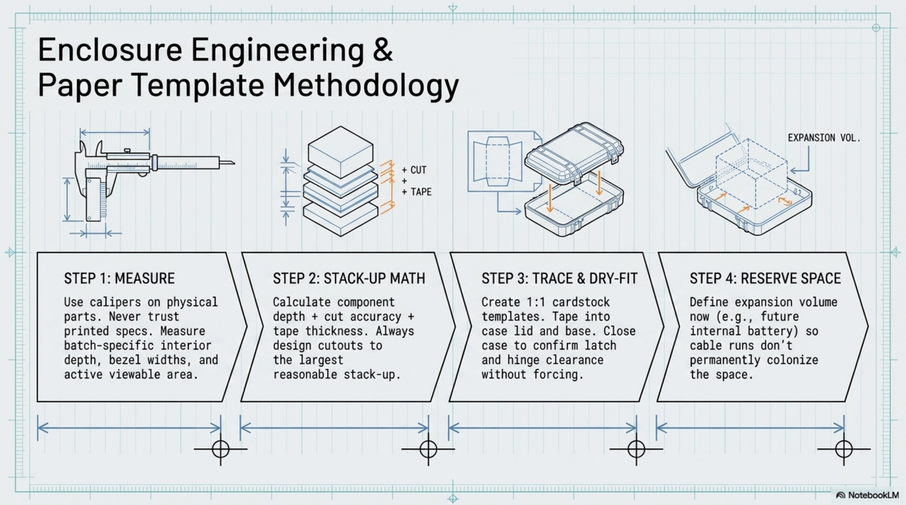

# Chapter 4: Enclosure Engineering

**Learning objectives:** Turn the Apache 2800's raw interior volume into a confirmed, measured layout plan using paper templates — before any plastic is cut.  
**Tools & materials:** Digital calipers, cardstock/paper, painter's tape, scissors, pencil.  
**Estimated time:** 2–3 hours

*Plate 5, Chapter 4: Enclosure Engineering*

## 4.1 Apache 2800 Anatomy

Cases in this family are typically a clamshell design with a foam-filled base and lid, a piano or pin hinge, and side latches. For this build, both the base and lid interiors are used — the lid carries the display, the base carries the compute core and keyboard. The hinge is the single most mechanically stressed point in the finished build, since it flexes every time the case opens, and is treated as a first-class design constraint rather than an afterthought.

## 4.2 Measurement Methodology

- VERIFY BEFORE CUTTING: The exact interior dimensions of your Apache 2800 unit and the exact

bezel/active-area dimensions of your specific Waveshare panel revision are not printed anywhere in this manual as fixed numbers. Case tolerances and panel bezel widths vary by production batch — you must measure your own physical parts with calipers. Recommended measurement sequence:

- Interior lid: length, width, and usable depth once the latch/hinge recesses are accounted for
- Interior base: length, width, and depth, including the raised rib pattern common to cases in this family
- Display: full outer bezel dimensions AND active viewable area dimensions separately — you cut to the active area, not the bezel
- Display depth including any driver board or ribbon connector that projects behind the panel
- Keyboard: footprint length × width × height with keycaps installed

## 4.3 Tolerance Stack-Up

Every physical fit in this build is the sum of several individual tolerances — the case's manufactured dimension, your cut accuracy, the display's bezel manufacturing tolerance, and the thickness of any tape or gasket material used in mounting. Design your cutout to the largest reasonable stack-up, not the nominal case: it's far easier to shim a slightly loose fit than to enlarge a too-tight one after the fact.

## 4.4 Layout Planning

With your own measurements in hand, sketch a top-down layout for the base (Pi+cooler+HAT+SSD stack, keyboard footprint, reserved upgrade space) and the lid (display position, cable exit point toward the hinge). Prioritize: airflow path for the Active Cooler's fan, a straight-as-possible cable run from lid to base through the hinge, and at least one reserved zone for a future upgrade (Chapter 13).

## 4.5 Paper Templates

| Step | Action |
|---|---|
| 1. Trace true-size outlines | On cardstock, trace 1:1 outlines of the display active area, the Pi+HAT+SSD stack, and the keyboard footprint, using your Section 4.2 measurements. |
| 2. Cut and dry-fit | Cut out each template and tape it into position in the lid and base. Close the case without forcing it to confirm nothing binds against the latch, hinge, or lid recess. |
| 3. Iterate | Adjust and re-tape until the case closes cleanly with every template in its final planned position. |

## 4.6 Future Expansion Volume

Reserve a defined pocket of interior volume now — even a modest one — for the highest-priority Chapter 13 upgrade you're likely to pursue (most builders reserve for an internal battery). Marking this zone on your paper template prevents cable runs and standoffs from unintentionally colonizing that space during Chapters 5–7.

## 4.7 CAD Reference Drawings

If you prefer a digital layout process over paper templates, the same methodology applies inside CAD software (FreeCAD, Fusion 360, or similar): create a sketch plane at your measured interior dimensions, import or draw the display active-area and Pi-stack footprints to scale, and iterate the layout digitally before committing to a physical template. The paper dry-fit in Section 4.5 remains a required final check regardless of whether you design digitally first — CAD catches geometry errors, but only a physical dry-fit catches real-world tolerance surprises. Chapter Summary

- All fit-critical dimensions in this build come from your own calipers, never from a printed number.
- Paper templates, dry-fit and iterated until the case closes cleanly, are the required gate before Chapter 5's irreversible cutting.
- Layout planning must account for airflow, hinge cable routing, and reserved upgrade space simultaneously.

Cross-references: See Chapter 5 for the cutting procedures that execute this plan, Chapter 13 for what the reserved expansion volume is typically used for.
