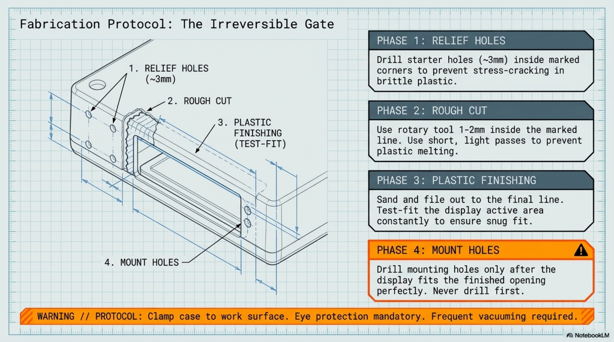

# Chapter 5: Fabrication

**Learning objectives:** Execute the confirmed template plan as physical cuts and holes, with a finishing process that produces a clean, snug display opening.  
**Tools & materials:** Rotary tool, plastic-cutting bits, sanding drum, drill + bit set, needle files, painter's tape, clamps, vacuum.  
**Estimated time:** 2–4 hours, plus drying/settling time if adhesives are used

*Plate 6, Chapter 5: Fabrication*

SAFETY: Eye protection is mandatory for this entire chapter. Clamp the case to your work surface — never hand-hold a piece being cut with a rotary tool.

- VERIFY BEFORE CUTTING: Do not begin this chapter until Chapter 4's paper templates have been confirmed

against your own measured parts and close cleanly in the case. There is no undo on a cut case.

## 5.1 Cut Sequencing

Cut in this order: relief/starter holes first, then the rough opening, then finish to final size, then mounting holes last — only after the opening itself is confirmed to fit. Drilling mounting holes before the opening is finished risks having to redrill if the opening shifts during finishing.

## 5.2 Protect and Prep

- Apply two layers of painter's tape over the cut area, inside and outside
- Re-transfer your confirmed cut lines onto the taped surface
- Clamp the case securely to your work surface

## 5.3 Drill Guide

Using a small bit (~3 mm), drill a starter/relief hole just inside each corner of the display cutout. These give your rotary tool an entry point and prevent stress-cracking at the corners — a standard practice for any rectangular cutout in brittle plastic.

## 5.4 Rough Cut

| Step | Action |
|---|---|
| 1. Cut inside the line | Cut roughly 1–2 mm inside your marked line with the rotary tool — you sand to the final line, not cut to it directly. |
| 2. Work in short passes | Multiple light passes rather than one deep pass; plastic melts and gums up bits under heavy, slow cutting pressure. |
| 3. Clear debris often | Vacuum periodically — buildup obscures your cut line and can catch the bit. |

## 5.5 Plastic Finishing

Switch to needle files and a sanding drum to bring the opening to your final line gradually, test-fitting the display's active area against the opening every few passes. The goal is a snug opening that just clears the active area without pinching it, leaving the bezel to rest against the case face. TIP: Sand in the direction of the cut edge, not across it, to avoid gouges visible around the display bezel.

## 5.6 Mistake Recovery

If an opening comes out slightly oversized despite careful work, a thin trim bezel (custom-cut from sheet styrene, or 3D-printed if you have access to a printer) mounted flush around the opening can recover a clean look without replacing the case. If a corner develops a stress crack despite relief holes, a small fillet of plastic-compatible adhesive on the interior face (never visible from outside) typically stabilizes it — treat this as a recoverable setback, not a failed build.

## 5.7 Drill Mounting Holes

Only after the display physically fits the finished opening, drill mounting holes at your marked, center-punched locations. Start with a small pilot bit and step up gradually to your final screw/standoff diameter to keep holes round and centered.

## 5.8 Cosmetic Finishing

Optional at this stage: a light bead of clear plastic-safe sealant around the outside edge of the display opening improves both appearance and dust resistance. If you're planning Chapter 13's custom bezels/labels upgrade, this is a reasonable point to mask off and prep for that cosmetic work, since the interior is already clean and dust-free.

## 5.9 Printable Cut Templates

Because exact cutout dimensions are specific to your measured hardware (Section 4.2), a generic printable template cannot be supplied as a fixed-dimension file without risking a wrong cut. Instead, use your paper template from Chapter 4 directly as the cutting guide — trace its confirmed outline onto painter's tape on the case rather than re-deriving dimensions from a printed sheet.

## 5.10 Inspection Checklist

- All painter's tape removed
- No sharp or rough edges remain to the touch
- Display active area clears the opening with no pinching, bezel seats flush
- Mounting holes are round, centered, and correctly sized for chosen standoffs
- Interior is fully vacuumed — no loose plastic dust remains

Chapter Summary

- Cut sequencing (relief holes → rough cut → finish → mounting holes) minimizes rework risk.
- Finishing is iterative — test-fit constantly rather than cutting to a single final pass.
- Fabrication mistakes are usually recoverable; don't treat a slightly oversized cut as a failed build.

Cross-references: See Chapter 6 for permanent mounting into these finished openings.
