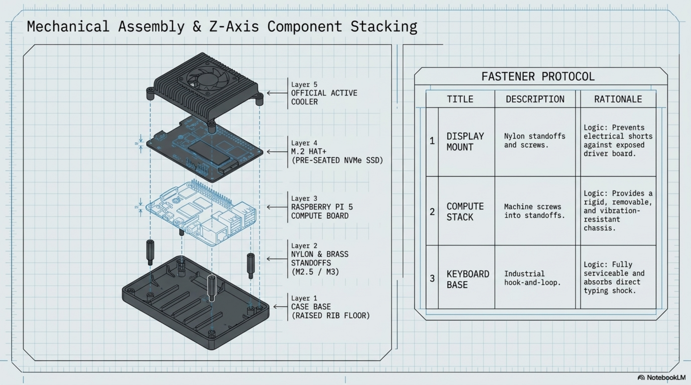

# Chapter 6: Mechanical Assembly

**Learning objectives:** Permanently mount the display, compute core, and keyboard with a serviceable, vibration-resistant fastening approach.  
**Tools & materials:** Nylon standoffs and screws, hook-and-loop fasteners or brackets, screwdriver set.  
**Estimated time:** 2–3 hours

*Plate 7, Chapter 6: Mechanical Assembly*

## 6.1 Display Mounting

| Step | Action |
|---|---|
| 1. Set standoffs | Install nylon standoffs into the drilled mounting holes from Chapter 5. Nylon avoids shorting anything on the display's driver board. |
| 2. Seat the panel | Position the display through the cutout and secure to the standoffs with nylon screws, tightening evenly in a cross pattern to avoid warping the bezel. |
| 3. Route the service loop | Route HDMI and USB (touch) cables toward the hinge with deliberate slack — a gentle rounded loop, not a tight fold — so repeated open/close cycles flex the loop instead of stressing the connectors. |

## 6.2 Pi Mounting

Mount the Pi+cooler+HAT+SSD stack on standoffs sized to your Chapter 4 depth measurement, oriented so the Active Cooler's fan has a clear, unobstructed intake and exhaust path. Do not mount it flush against a foam wall or the case lid — airflow clearance is a functional requirement, not a preference.

## 6.3 SSD/HAT Mounting

If not already fully seated during Chapter 3's bench assembly, confirm the SSD's mounting screw is tight and the HAT+'s standoffs to the Pi board are secure before final case mounting — this connection becomes far harder to service once the stack is buried behind the display cabling.

## 6.4 Keyboard Retention

Secure the Razer Huntsman Mini using removable industrial-strength hook-and-loop fasteners (preferred — allows periodic removal for cleaning or travel) or custom-fit brackets for a permanent mount. Confirm the keyboard sits flush and doesn't rock during typing at your intended working angle.

## 6.5 Fastener Selection

| Location | Recommended fastener | Reason |
|---|---|---|
| Display to standoffs | Nylon screws | Avoids shorting the driver board |
| Pi stack to case | M2.5/M3 machine screws into standoffs | Standard, serviceable, removable |
| Keyboard | Hook-and-loop (preferred) or brackets | Hook-and-loop allows removal for cleaning/travel |
| Cable clips | Adhesive mounts + zip ties | Adhesive for wall runs, ties for strain relief at connectors |

## 6.6 Exploded Assembly Reference

For reference during assembly, the stacking order in the compute zone from the case floor upward is: standoffs → Raspberry Pi 5 board → M.2 HAT+ (with SSD already seated) → Active Cooler on top of the Pi's SoC. The HAT+ sits above the Pi board via its own standoffs, connected by the FPC ribbon to the Pi's underside PCIe connector — keep this ribbon cable's path in mind so it isn't stressed when the HAT+ standoffs are tightened. Plate 7 (chapter opening) shows this stack exploded along the Z-axis.

## 6.7 Serviceability Review

Before moving to Chapter 7, do a deliberate serviceability check: could you remove the SSD, reseat the keyboard, or access the Pi's USB ports for troubleshooting without fully disassembling the case? If any of these require destructive disassembly, revisit the mounting approach now, while it's still easy to change — not after Chapter 8's cabling is finalized. Chapter Summary

- Mounting order matters — display and Pi stack are secured with airflow and cable routing already planned from Chapter 4.
- Fastener choice (nylon vs. machine screws vs. hook-and-loop) is matched to each component's servicing needs.
- A serviceability check before final cabling prevents future maintenance headaches.

Cross-references: See Chapter 7 for the cabling that connects these now-mounted components, Chapter 12 for ongoing maintenance access.
