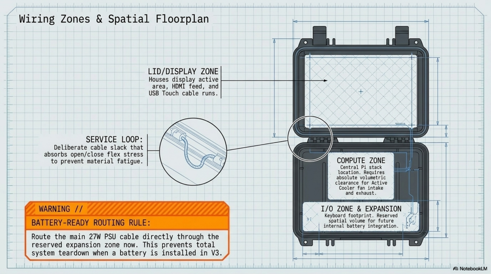

# Chapter 7: Electrical Integration

**Learning objectives:** Route and secure every cable in the build using a zone-based plan, understand the signal/power topology, and leave the design battery-ready.  
**Tools & materials:** Adhesive cable clips, zip ties, the HDMI/USB cables selected in Chapter 2.  
**Estimated time:** 1–2 hours, plus the one-hour operational test


*Plate 8, Chapter 7: Electrical Integration*

## 7.1 Power Topology

This build uses single-source power: the official 27W USB-C PSU feeds the Pi 5 directly, and every other component (display, keyboard, NVMe SSD) draws power downstream of the Pi itself, either over USB or the HAT+'s PCIe connection. There is no independent power rail for the display in this baseline design — it is powered entirely through its HDMI/USB connection to the Pi. See Plate 4 (Chapter 3) for the full topology diagram.

## 7.2 Wiring Zones

| Zone | Contents | Routing notes |
|---|---|---|
| Display zone | HDMI cable, USB touch cable | Routes from lid, across the hinge service loop, to the compute zone |
| Compute zone | Pi 5, Active Cooler, M.2 HAT+, NVMe SSD | Central; keep fan intake/exhaust clear of all cabling |
| User I/O zone | Keyboard USB-C cable, any external ports | Shortest practical run to the Pi's USB ports |

## 7.3 Cable Routing & Connector Pinouts

This build uses only standard, keyed connectors (HDMI, USB-A, USB-C) — there is no custom pinout to document, which is a deliberate simplicity choice. If a future upgrade (Chapter 13) introduces a GPIO breakout or custom wiring, pinout documentation becomes necessary at that point and should be added to the Appendix (Chapter 15) pinout reference.

## 7.4 Simplified Wiring Diagram

```bash
[27W USB-C PSU] --power--> [Raspberry Pi 5 USB-C IN]
[Raspberry Pi 5] --HDMI0--> [Waveshare 8" Display: HDMI IN]
[Raspberry Pi 5] --USB----> [Waveshare 8" Display: Touch USB]
[Raspberry Pi 5] --USB-C--> [Razer Huntsman Mini]
[Raspberry Pi 5] --PCIe (via HAT+)--> [NVMe SSD]
[Raspberry Pi 5] --4-pin header--> [Active Cooler fan]
```

- VERIFY BEFORE CUTTING: Topology constraint: only HDMI0 (nearest the USB-C power input) supports full

primary display output and CEC behavior on Pi 5 — always use HDMI0 for the primary display in this build. Do not substitute HDMI1.

## 7.5 USB Topology

The Pi 5 exposes multiple USB ports from a single internal hub; keyboard and touch-display USB should be distributed across separate physical ports where possible rather than daisy-chained through an external hub, to avoid contention during simultaneous typing and touch input.

## 7.6 Grounding

All components in this build are low-voltage DC devices powered through standard USB-C/HDMI connectors with their own internal isolation — there is no separate chassis grounding step required for the baseline build. This changes if a future upgrade introduces mains-voltage components (e.g., a mains-charged battery system), which should be treated as its own electrical safety review at that time.

## 7.7 Battery-Ready Architecture

To keep the door open for Chapter 13's battery upgrade without rework, route the PSU's USB-C cable through the reserved expansion zone marked in Chapter 4.6, rather than sealing it directly against a wall. This makes it straightforward to later insert a USB-C PD pass-through battery board inline without re-routing the entire power path — and prevents total system teardown when a battery is installed in V3.

## 7.8 Electrical Safety

SAFETY: Always disconnect power before touching internal cabling, even for low-voltage USB/HDMI connections — this is a good habit that carries over directly if you add mains-powered components later.

## 7.9 Cable Lengths

- VERIFY BEFORE CUTTING: Exact cable lengths depend entirely on your final measured layout from Chapters 4–6.

Buy or make cables slightly longer than your bench estimate, then trim your routing plan to fit — easier than discovering a cable is a centimeter short after final assembly.

## 7.10 Securing All Cabling

- Adhesive cable-clip mounts on interior walls for major runs
- Small zip ties at connector-adjacent points for strain relief, trimmed flush
- A visible service loop at the hinge, verified not to bind at full-open and full-closed positions
- Nothing overlapping the Active Cooler's fan blade path

## 7.11 One-Hour Operational Test

Before final sealing, power the assembled-but-not-yet-closed case and run it for a full hour under light use. Watch for any cable that shifts toward the fan, unusual heat at any connector, display flicker or touch dropouts as cables settle, and keyboard responsiveness at your typical working angle. Chapter Summary

- Power topology is single-source and simple by design — no custom wiring in the baseline build.
- Zone-based cable routing keeps the build serviceable and keeps cabling clear of the fan.
- Routing the PSU cable through the reserved expansion zone keeps the design battery-ready without rework.

Cross-references: See Chapter 8 for thermal implications of cable placement, Chapter 13 for the battery upgrade this section prepares for.
