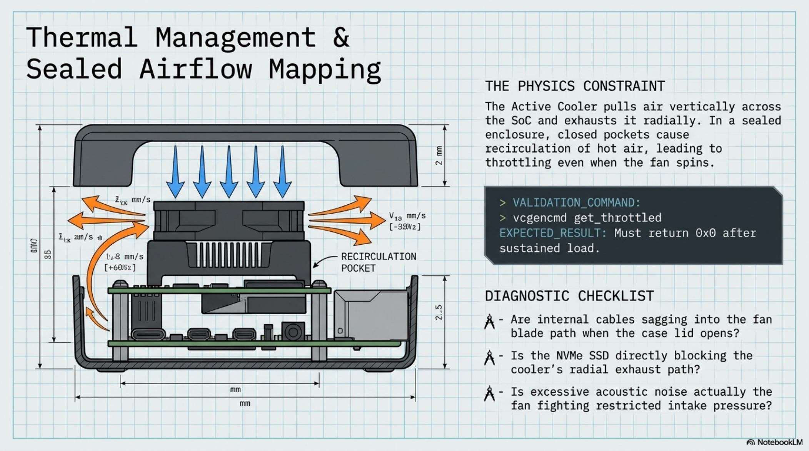

# Chapter 8: Cooling & Thermal Management

**Learning objectives:** Confirm airflow inside the sealed case matches the bench thermal behavior validated in Chapter 3, and know how to diagnose it if it doesn't.  
**Tools & materials:** Assembled case (post-Chapter 7), stress-ng, a way to monitor temperature over time.  
**Estimated time:** 1–2 hours


*Plate 9, Chapter 8: Cooling & Thermal Management*

## 8.1 Airflow Mapping

The Active Cooler pulls air across the SoC and exhausts it radially. Inside a closed enclosure, this only works if there is a clear intake path (typically from a vent near the fan's top) and a clear exhaust path (vent or gap elsewhere in the case) — a sealed pocket around the cooler will recirculate warm air and throttle the board even though the fan itself is running fine.

## 8.2 Fan Placement Review

Revisit your Chapter 6.2 Pi mounting: confirm nothing (foam remnants, cable slack, the case's raised rib pattern) sits within the fan's immediate intake or exhaust radius. This is worth checking with a flashlight and the case at the same angle you'll actually use it — gravity can shift slack cabling toward the fan when the lid is opened to a working angle versus laid flat.

## 8.3 Heat Sources

| Component | Heat contribution | Note |
|---|---|---|
| Pi 5 SoC | Primary and dominant | Managed by Active Cooler |
| NVMe SSD | Secondary, load-dependent | Sustained heavy I/O adds measurable heat near the HAT+ |
| PSU/USB-C circuitry | Minor | Rarely a practical concern at this power level |

## 8.4 Vent Design

If your case's stock venting proves insufficient during this chapter's testing, small additional vents (drilled or cut, following the same fabrication discipline as Chapter 5) can be added near the fan's intake and exhaust. Treat this as an iterative fix informed by real thermal data from Section 8.5, not a preemptive modification made before you've confirmed it's needed.

## 8.5 Thermal Testing (Assembled)

Repeat the Chapter 3 stress test with the case now fully assembled and closed, and compare against your logged bench baseline:

```bash
stress-ng --cpu 4 --timeout 600s --metrics-brief
watch -n 2 vcgencmd measure_temp
vcgencmd get_throttled # check immediately after the run
# EXPECTED RESULT: must return 0x0 after sustained load
```

A meaningfully higher steady-state temperature assembled versus on the open bench is expected to some degree — the diagnostic question is whether it approaches throttling thresholds (any non-zero get_throttled result after a sustained run) or stays comfortably below them.

## 8.6 Noise Reduction

If fan noise is noticeable under sustained load, confirm first that it's not compensating for a partially blocked airflow path — a fan working harder than expected against restricted airflow is both louder and less effective than the same fan with a clear path. Only pursue acoustic dampening (never blocking) after confirming airflow is unobstructed.

## 8.7 Thermal Troubleshooting

| Symptom | Likely cause | Fix |
|---|---|---|
| Assembled temps much higher than | Restricted airflow inside case | Recheck Section 8.2 fan placement, consider Section |
| bench baseline |  | 8.4 additional venting |
| Throttling only under combined | Localized heat near HAT+/SSD | Confirm SSD isn't directly blocking cooler exhaust; |
| CPU+NVMe load |  | reroute if needed |
| Fan runs constantly at high speed | Thermal pad not seated (see | Reseat cooler; recheck for airflow blockage |
| even at idle | Ch.3.3), or ambient case temp elevated |  |

Chapter Summary

- Thermal validation is repeated assembled, not assumed to match the open-bench results from Chapter 3.
- Airflow path integrity, not just fan presence, is what prevents throttling in a sealed case.
- Additional venting is an evidence-based fix, applied after testing shows it's needed.

Cross-references: See Chapter 3 for baseline bench thermal behavior, Chapter 11 for field thermal testing under real transport/use conditions.
