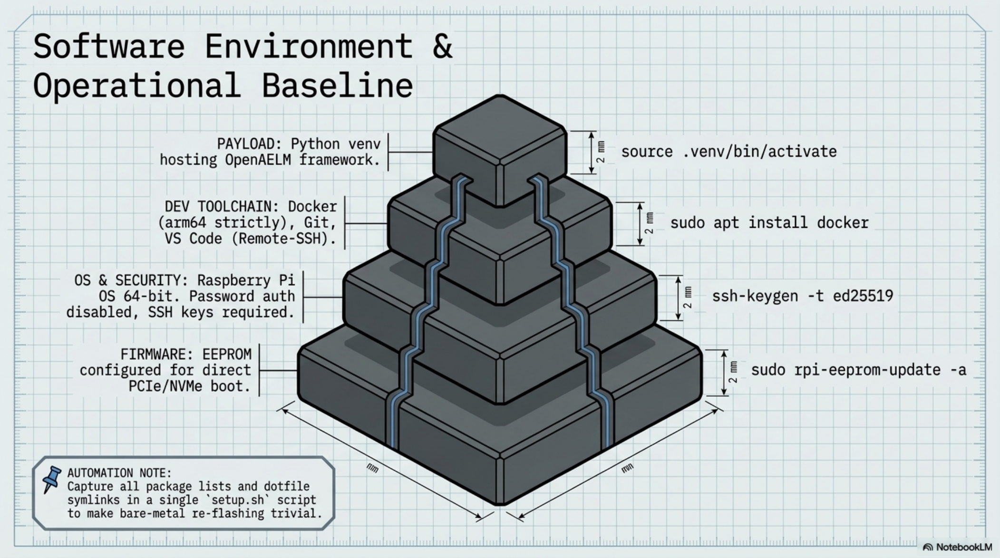

# Chapter 9: Software Installation

**Learning objectives:** Install and secure the base operating system, from imaging through a defensible security baseline, before layering development tools on top.  
**Tools & materials:** Assembled, thermally-validated cyberdeck; a second computer for imaging if not cloning from the bench microSD.  
**Estimated time:** 1–2 hours


*Plate 10, Chapter 9: Software Installation*

## 9.1 OS Imaging

Raspberry Pi OS (64-bit) is imaged using Raspberry Pi Imager, either directly to the NVMe SSD (if imaging from another machine with an NVMe-to-USB adapter) or first to a microSD card and then migrated, as covered in Chapter 3.

## 9.2 NVMe Boot Confirmation

```bash
lsblk # confirm the NVMe device is present and mounted as root
df -h / # confirm root filesystem is on the NVMe device, not an SD card
```

## 9.3 SSH

```bash
sudo raspi-config
# Interface Options > SSH > Enable
# Or headless: place an empty file named 'ssh' in the boot partition
# before first boot.
```

## 9.4 Users

Change the default account's password immediately after first boot. If this device will be used by more than one person, or you want a clean separation between personal and project accounts, create additional users with sudo adduser <name> and add them to the sudo group only if they need administrative rights.

## 9.5 Networking

Configure Wi-Fi via raspi-config or nmcli for headless setups. If this device will regularly connect to untrusted networks (cafes, conferences) while traveling, treat network configuration as part of the security baseline in Section 9.8, not a separate concern.

## 9.6 Updates

```bash
sudo apt update && sudo apt full-upgrade -y
sudo apt install -y unattended-upgrades # optional: automatic security updates
```

## 9.7 Firmware

Firmware (EEPROM) updates were covered in Chapter 3 as platform theory; treat them here as an ongoing task — re-run sudo rpi-eeprom-update -a on the same cadence as your OS updates, since bootloader fixes occasionally address real boot-reliability issues.

## 9.8 Security Baseline

- Change default password immediately
- Enable SSH key authentication and disable password authentication once key access is confirmed working
- Keep the OS and firmware on a regular update cadence (see Chapter 12 maintenance schedule)
- If traveling with this device regularly, consider full-disk encryption for the NVMe SSD, weighed against the added complexity of unlocking on each boot

TIP: Test SSH key login from a second device before disabling password authentication — locking yourself out of a headless device is an easy mistake to make once. Chapter Summary

- OS imaging and NVMe boot confirmation build directly on the platform theory from Chapter 3.
- A security baseline (SSH keys, disabled password auth, update cadence) is established before development tools are layered on.

Cross-references: See Chapter 10 for the development environment installed on top of this OS baseline, Chapter 12 for the ongoing update schedule.
