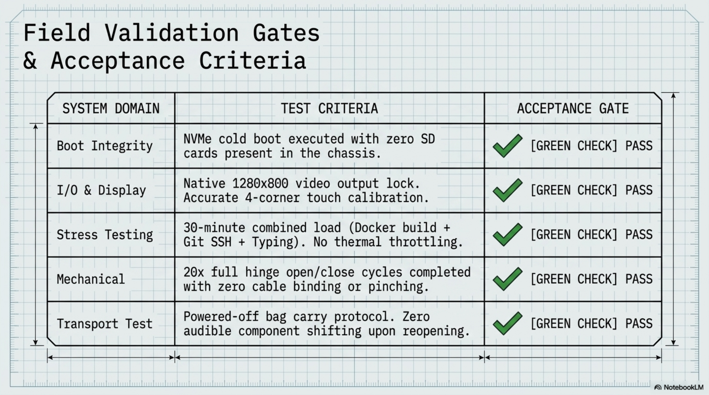

# Chapter 11: Field Testing & Validation

**Learning objectives:** Validate the finished device against real acceptance criteria, including transport and sustained-use conditions, not just a bench checklist.  
**Tools & materials:** The fully assembled and software-configured cyberdeck.  
**Estimated time:** Several days of intermittent real use, plus one dedicated 1–2 hour test session

*Plate 11, Chapter 11: Field Testing & Validation*

## 11.1 Acceptance Criteria

| Item | Test | Pass criteria |
|---|---|---|
| NVMe boot | Cold boot with no SD card present | Boots to desktop/console reliably |
| Display | Full-brightness, full-resolution test image | No dead pixels, no flicker, correct 1280×800 |
| Touch | Tap all four corners and center | Accurate registration, no drift |
| Keyboard | Every key pressed once in a text editor | All keys register correctly |
| Wi-Fi | Sustained transfer test | Stable, no drop-outs over 10+ min |
| Cooling | Repeat of Chapter 8.5 stress test | No throttling, temps consistent with logged baseline |
| Power | Full load with official 27W PSU only | No under-voltage warnings via vcgencmd get_throttled |
| Hinge/cabling | Full open/close cycle × 20 | No binding, no visible cable stress |

## 11.2 Transport Testing

Carry the closed, powered-off case through your normal transport routine (bag, backpack, car) at least once before relying on it for real work. Reopen and check: did anything shift audibly, does the lid still close/latch cleanly, and is there any new looseness in the display or keyboard mounting.

## 11.3 Stress Testing

Beyond the Chapter 8 thermal stress test, run a realistic combined-load session: a Docker build, a Git operation over SSH, and active typing/display use simultaneously, for at least 30 minutes. This exercises CPU, storage I/O, network, and thermal load together in a way the isolated Chapter 8 test doesn't.

## 11.4 Battery Simulation

Even in the baseline mains-powered build, it's worth confirming behavior on a USB-C PD power bank if you own one, as a preview of Chapter 13's battery upgrade — specifically whether the power bank can sustain the Pi 5's combined load without brownout, which tells you the minimum wattage spec to look for when selecting a permanent battery solution.

## 11.5 Performance Logging

Log the results of this chapter's tests in your build journal in the same format as your Chapter 3 bench baseline, so future comparisons (after maintenance, after an upgrade) have a real assembled/field reference point, not just the original bench numbers.

## 11.6 Benchmark Table Template

| Date | Test | Result | Notes |
|---|---|---|---|
|  | Idle temp 10-min stress-ng temp get_throttled result Combined-load 30-min session |  |  |

Chapter Summary

- Acceptance testing covers real transport and combined-load conditions, not just isolated bench checks.
- A battery-bank simulation previews the power requirements for Chapter 13's battery upgrade.
- Logged results create a real comparison baseline for future maintenance and upgrades.

Cross-references: See Chapter 8 for the thermal test this chapter repeats under field conditions, Chapter 12 for what happens after acceptance.
