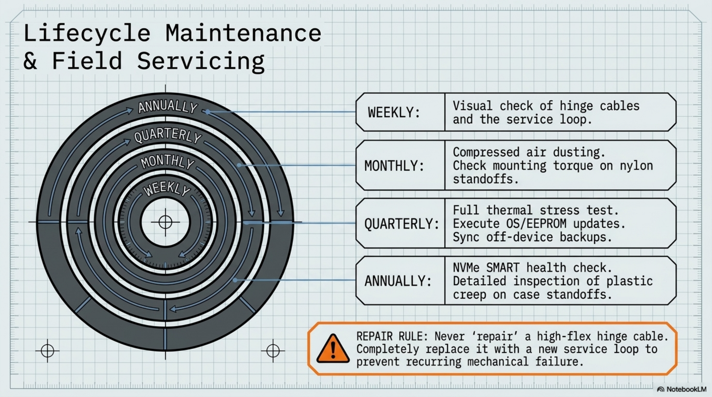

# Chapter 12: Maintenance & Repair

**Learning objectives:** Establish a recurring maintenance schedule and know the standard repair procedures for the most common wear points.  
**Tools & materials:** Compressed air, screwdriver, smartmontools (software), spare small hardware.  
**Estimated time:** Ongoing — see schedule


*Plate 12, Chapter 12: Maintenance & Repair*

## 12.1 Cleaning

Power off and unplug before any cleaning. Compressed air clears dust from vents and the fan; a slightly damp microfiber cloth handles the display and case exterior. Avoid liquid cleaners near any USB or HDMI port.

## 12.2 Inspection Intervals & Schedule

| Interval | Task | Notes |
|---|---|---|
| Weekly (active use) | Visual check of exposed cabling and hinge area | Look for fraying, pinching, or loose clips |
| Monthly | Compressed-air dust removal from vents and fan | Power off and unplug before cleaning |
| Monthly | Check screw torque on display and keyboard mounts | Snug, do not overtighten into plastic bosses |
| Quarterly | Full thermal test under sustained load | Run stress-ng for 20–30 min, log peak temps |
| Quarterly | OS and firmware updates | sudo apt full-upgrade, sudo rpi-eeprom-update |
| Interval | Task | Notes |
| Quarterly | Backup Projects directory and dotfiles | Off-device backup (external drive or cloud) |
| Annually | Inspect NVMe SSD health | sudo smartctl -a /dev/nvme0 if smartmontools installed |
| Annually | Re-check all standoffs for plastic creep/loosening | Common in drilled plastic mounts over time |

## 12.3 SSD Health

```bash
sudo apt install -y smartmontools
sudo smartctl -a /dev/nvme0
# Watch for reallocated sectors, rising temperature trend, or declining
# available spare percentage over successive checks.
```

## 12.4 Cable Replacement

If a cable shows fraying at the hinge service loop, replace it rather than repairing it — the labor to properly reroute is the same either way, and a repaired cable at a high-flex point is a recurring failure risk. Reuse the same slack service-loop routing from Chapter 6.1 with the new cable.

## 12.5 Fan Servicing

If the Active Cooler's fan becomes noisy or its speed seems unresponsive to load, first rule out airflow obstruction (Chapter 8.2) before assuming fan failure. If the fan itself is confirmed faulty, the Active Cooler is a bolt-on assembly and can be replaced as a unit without desoldering.

## 12.6 Repair Procedures

| Failure | Repair approach |
|---|---|
| Loose standoff in plastic boss | Replace with next-size-up standoff, or add a thread insert if recurring |
| Cracked mounting boss | Reinforce with a small backing plate and longer screw into the case wall |
| Failed SSD | Swap drive, reflash from your Chapter 10.8 automation script and latest backup |
| Damaged display | Since it's a mounted, cabled component (Ch.6.1), replacement follows the same mounting steps as original install |

## 12.7 Spare Parts Inventory

Worth keeping on hand: a few spare standoffs and screws in your used sizes, a spare short HDMI/USB cable of the same length class used at the hinge, and a couple of adhesive cable clips — small, cheap items whose absence turns a five-minute repair into a delayed one. Chapter Summary

- A defined maintenance schedule, not ad-hoc attention, is what keeps the device reliable long-term.
- Most likely failures (cables, standoffs, SSD) have straightforward, non-destructive repair paths.
- A small spare-parts kit removes the most common reason a five-minute fix turns into a week's delay.

Cross-references: See Chapter 14 for symptom-based troubleshooting when a repair need isn't obvious yet.
