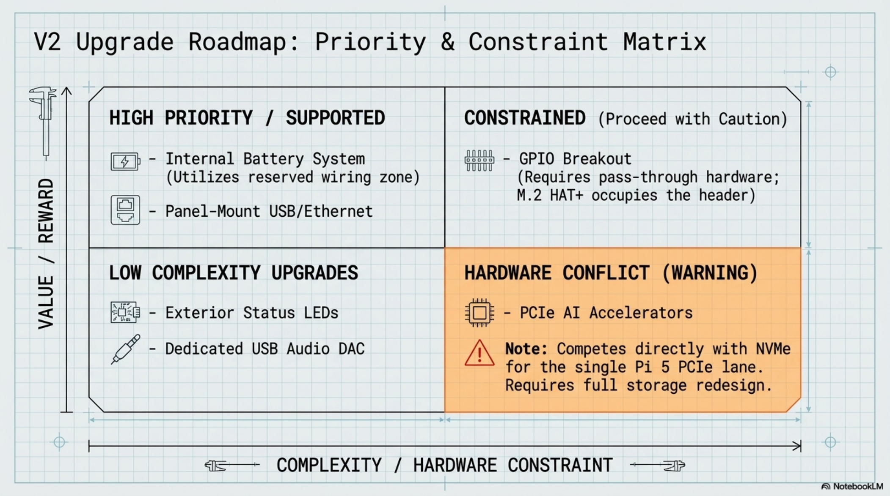

# Chapter 13: Upgrade Paths

**Learning objectives:** Evaluate and plan the upgrade roadmap in priority order, building on the reserved volume and battery-ready wiring from earlier chapters.  
**Tools & materials:** Varies by upgrade; each is scoped individually below.  
**Estimated time:** Varies — each upgrade is its own project

*Plate 13, Chapter 13: Upgrade Paths*

## 13.1 Battery Integration

The highest-priority upgrade for untethered field use. Verify the power budget against the Pi 5's combined draw (Chapter 3.2) before selecting a battery/PD-trigger board — undersizing this is the most common battery-upgrade mistake. Uses the reserved expansion volume from Chapter 4.6 and the battery-ready power routing from Chapter 7.7.

## 13.2 Panel-Mount I/O

Panel-mounted USB and Ethernet, using the routing space reserved in Chapter 7's wiring plan. This is a fabrication task (follow Chapter 5's cut/finish discipline for the new cutout) plus a wiring task (extend, don't replace, the existing internal USB topology from Chapter 7.5).

## 13.3 USB Hub

If adding multiple peripherals beyond the Pi's native ports, a powered USB hub avoids the current-budget risk of an unpowered hub competing with the display and keyboard for the Pi's own USB power delivery.

## 13.4 GPIO Breakout

Routed to an accessible panel for sensor/hobby-electronics experimentation. Note the M.2 HAT+ sits directly on the Pi's GPIO header — a GPIO breakout for this build requires a pass-through HAT or ribbon-cable breakout compatible with the HAT+ already occupying that header, not a direct header connection.

## 13.5 Displays

If a future revision changes the display, treat it as a full repeat of Chapters 4–6 for that component — new bezel/active-area measurements, a new paper template, and a re-cut opening. The rest of the build (compute core, keyboard, software) is unaffected.

## 13.6 Networking

Beyond the panel-mount Ethernet in Section 13.2, consider whether your OpenAELM workflow benefits from a wired connection for large model or dataset transfers versus relying on Wi-Fi — this is a workflow decision, not a hardware constraint, since the Pi 5 supports both natively.

## 13.7 AI Accelerators

- VERIFY BEFORE CUTTING: Hardware conflict: a PCIe-attached AI accelerator competes with the NVMe SSD for

the Pi 5's single PCIe lane via the HAT+ — these cannot coexist without a PCIe switch/expansion board, which is a significant redesign, not a drop-in upgrade. Evaluate whether cloud or networked inference (using this deck as a thin client) meets the need first, since it avoids this hardware conflict entirely.

## 13.8 Status LEDs & Speakers

Lower-complexity, high-satisfaction additions: status LEDs (power/activity/thermal indicators) and small I2S or USB DAC-driven speakers. Both are good candidates for a first upgrade project, since they don't compete for the constrained PCIe lane or case volume the way Sections 13.1 and 13.7 do.

## 13.9 Version Roadmap

| Priority | Upgrade | Depends on |
|---|---|---|
| 1 | Internal battery system | Reserved volume (Ch.4.6), battery-ready wiring (Ch.7.7) |
| 2 | Panel-mount USB/Ethernet | Wiring zones (Ch.7.2) |
| 3 | Powered USB hub | None — standalone addition |
| 4 | GPIO breakout | Compatible pass-through hardware given HAT+ occupancy |
| 5 | Status LEDs / speakers | None — standalone, low-complexity |
| 6 | Improved ventilation | Evidence from Ch.8 thermal testing |
| 7 | Custom bezels/labels | Cosmetic, done last |

Chapter Summary

- Every upgrade in this roadmap builds on a specific decision made earlier in the manual — battery on reserved volume, I/O on wiring zones, GPIO constrained by the HAT+'s header occupancy.
- AI accelerators are the one upgrade with a genuine hardware conflict (shared PCIe lane) worth evaluating carefully before purchase.

Cross-references: See Chapter 4.6 and 7.7 for the groundwork this chapter builds on.
