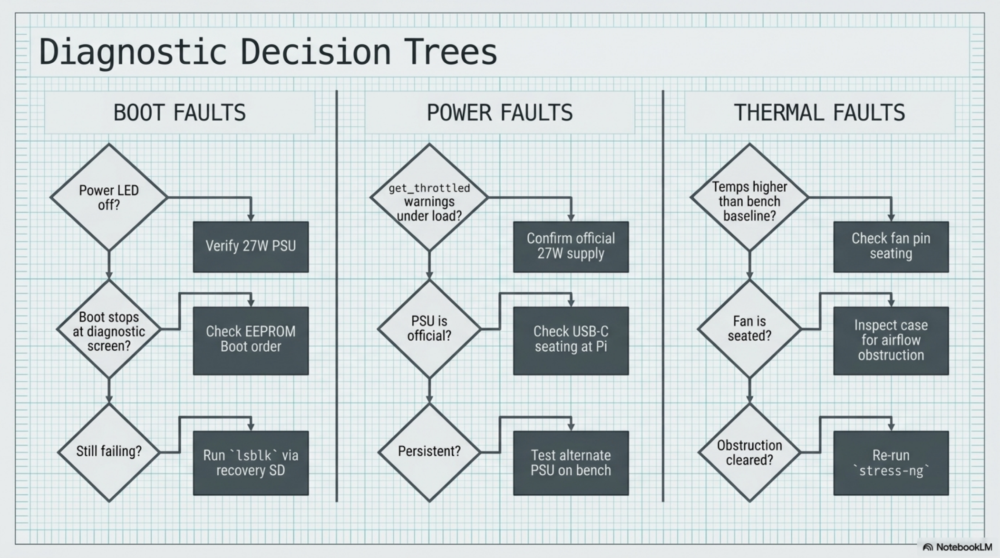

# Chapter 14: Troubleshooting Reference

**Learning objectives:** A symptom-first reference and decision trees for diagnosing the most common build and operational failures.  
**Tools & materials:** None — diagnostic reference chapter.  
**Estimated time:** As needed


*Plate 14, Chapter 14: Troubleshooting Reference*

## 14.1 Boot Issues — Decision Tree

No boot at all → check power LED. If off: verify PSU is the official 27W unit and cable is fully seated. If power LED is on but nothing displays → go to Section 14.3. If it boots to a rainbow/diagnostic screen and stops → check EEPROM boot order (Chapter 9.2) and confirm the NVMe device appears in lsblk from a recovery microSD boot.

## 14.2 Common Failures Table

| Symptom | Likely cause(s) | Fix |
|---|---|---|
| No display output | Cable seated wrong; wrong HDMI port; config.txt override | Reseat micro-HDMI in HDMI0. Check /boot/firmware/config.txt for forced resolution overrides. Test display on another HDMI |

```bash
source.
```

| Pi won't boot from | EEPROM boot order not updated; | Run sudo rpi-eeprom-update -a then reboot. Confirm boot order |
|---|---|---|
| NVMe | SSD not detected; underpowered | includes NVMe. Check lsblk for the drive. |
| System throttling / | Active Cooler not seated; poor | Check vcgencmd measure_temp and get_throttled. Reseat |
| thermal warnings | airflow inside case | cooler. Revisit Chapter 8 airflow mapping. |
| Symptom | Likely cause(s) | Fix |
| Touchscreen not | USB touch controller not | Run lsusb to confirm touch controller appears. Try alternate USB |
| responding | enumerated; wrong cable | port. |
| Keyboard not detected | USB-C cable fault; hub power budget exceeded | Test keyboard directly on another device first. Check dmesg / tail after plugging in. |
| Random reboots under | Insufficient power delivery | Confirm using the official 27W PSU. Check get_throttled for |
| load |  | under-voltage bits. |
| NVMe not recognized at | HAT+ seating; PCIe not enabled; | Reseat the M.2 HAT+ ribbon fully. Confirm SSD is on the Pi 5 |
| all | SSD compatibility | compatibility list. |
| Display flickering | Marginal HDMI cable; EMI from | Swap to a higher-quality short cable. Route HDMI away from |
| intermittently | nearby cables | PSU/USB lines. |
| Hinge cables fraying | Repeated flex without strain relief | Add/renew a service loop with slack absorbed mid-loop, not at |
| over time |  | connectors. |

## 14.3 Display Issues — Decision Tree

Power light on Pi, nothing on screen → confirm HDMI0 is used, not HDMI1. Reseat cable at both ends. Test the display on a different HDMI source to isolate display vs. Pi. If the display works elsewhere, check config.txt for a resolution override that doesn't match the panel's native 1280×800.

## 14.4 Power Faults — Decision Tree

Under-voltage warning in get_throttled → first confirm it's the official 27W PSU, not a substitute. If confirmed official, check the cable itself for damage, then check for a loose USB-C connection at the Pi. Persistent under-voltage with a known-good official PSU and cable, under combined CPU+NVMe load, may indicate a Pi hardware fault — worth testing the same PSU/cable on a different Pi 5 if available to isolate.

## 14.5 Thermal Faults — Decision Tree

See Chapter 8.7 for the full thermal troubleshooting table — this section cross-references rather than duplicates it, since thermal diagnosis depends heavily on the airflow mapping established in that chapter. The short chain, as on the chapter plate: temps higher than bench baseline → check fan pin seating → confirm fan is seated → inspect case for airflow obstruction → clear obstruction → re-run stress-ng.

## 14.6 Repair Flowchart Summary

General escalation order for any unclear fault: (1) reproduce on the bench outside the case if possible, isolating hardware from enclosure-induced variables; (2) check the simplest explanation first — cable seating, official PSU, correct port — before suspecting component failure; (3) consult the specific decision tree above; (4) if still unresolved, log the symptom and steps tried in your build journal and treat it as a standing open item rather than guessing further. Chapter Summary

- Diagnosis follows a consistent order: reproduce simply, check the simplest cause first, then consult the specific decision tree.
- Thermal faults are cross-referenced to Chapter 8 rather than duplicated, since airflow mapping context matters for diagnosis.

Cross-references: See Chapter 8.7 for thermal-specific troubleshooting, Chapter 12.6 for repair procedures once a fault is diagnosed.
