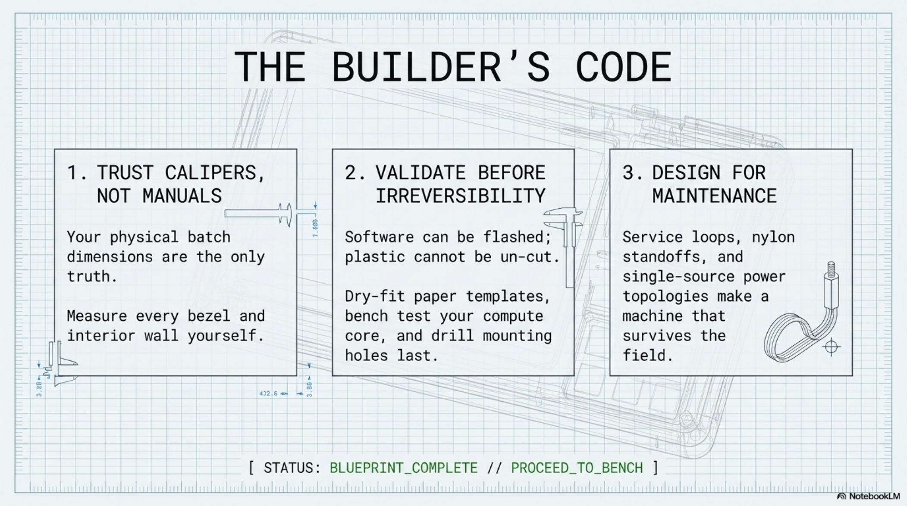

# Chapter 15: Appendices

**Learning objectives:** Reference material: commands, worksheets, glossary, and build tracking tools referenced throughout the manual.  
**Tools & materials:** None.  
**Estimated time:** Reference — as needed

*Plate 15, Chapter 15: Appendices*

## 15.1 Linux Command Reference

| Command | Purpose |
|---|---|
| vcgencmd measure_temp | Current SoC temperature |
| vcgencmd get_throttled | Throttling/under-voltage status (0x0 = healthy) |
| sudo rpi-eeprom-update -a | Update Pi bootloader firmware |
| sudo raspi-config | Interactive config tool (boot order, SSH, etc.) |
| lsblk | List block devices — confirm NVMe presence/boot device |
| lsusb | List USB devices — confirm keyboard/touch controller enumeration |
| dmesg / tail | Recent kernel log — connection/enumeration errors |
| sudo smartctl -a /dev/nvme0 | NVMe SSD health report |
| stress-ng --cpu 4 --timeout 600s | CPU stress test |
| docker run hello-world | Verify Docker installation |

## 15.2 Pinout & Connector Reference

This build uses only standard keyed connectors (HDMI, USB-A, USB-C) with no custom pin mapping. If Chapter 13.4's GPIO breakout is added, document the specific pinout of your chosen pass-through hardware here, since it will be specific to that product rather than a fixed value this manual can print in advance.

## 15.3 Measurement Worksheet

| Measurement | Your value | Tool used | Date |
|---|---|---|---|

Case interior lid (L×W×D) Case interior base (L×W×D) Display active area (L×W) Display outer bezel (L×W) Display depth incl. driver board Keyboard footprint (L×W×H)

## 15.4 Cable Worksheet

| Cable | Measured run length | Cable purchased | Notes |
|---|---|---|---|

HDMI (display) USB (touch) USB-C (keyboard)

## 15.5 Build Log Template

Use the Chapter 1.7 build journal format for every entry: date, chapter/section, what was measured or done, deviations from plan, photo reference, and open questions.

## 15.6 Glossary

| Term | Definition |
|---|---|
| EEPROM | The Pi's onboard bootloader firmware, updatable independent of the OS |
| HAT+ | Hardware Attached on Top — official Raspberry Pi add-on board standard, here providing the M.2 NVMe interface |
| Service loop | A deliberate slack loop in a cable that absorbs flex at a hinge or moving joint, protecting the connectors at either end |
| Throttling | The Pi's automatic performance reduction in response to high temperature or insufficient power |
| Tolerance stack-up | The cumulative effect of multiple individual manufacturing/cutting tolerances on a final physical fit |
| Active area | The actual visible/touchable portion of a display panel, distinct from its outer bezel |

## 15.7 Photo Checklist

- Bench assembly, before case work (Chapter 3)
- Paper templates dry-fit in the case (Chapter 4.5)
- Finished cut opening, before mounting (Chapter 5.10)
- Fully mounted interior, before final cable dress (Chapter 6.7)
- Final assembled interior with cabling secured (Chapter 7.10)
- Closed, latched exterior — the finished device

## 15.8 Revision Log

| Version | Notes |
|---|---|
| V1 | 8-chapter baseline builder's manual |
| V2 | Expanded to 15 chapters per the author blueprint: platform theory, enclosure engineering methodology, electrical integration, thermal management, field testing, upgrade roadmap, and full appendices |
| V2 Integrated | Blueprint plates merged into the handbook as chapter-opening figures |

Closing Notes This manual is a practical, engineering-grounded foundation — not a substitute for measuring your own parts. The exact cutout dimensions, screw sizes, and standoff lengths for your build depend on the specific case batch and display revision you purchased, and should always be verified with calipers before cutting, never against a printed number. Build incrementally, validate at every gate, and keep the worksheets in this appendix current. That discipline, more than any single dimension in this manual, is what determines whether this becomes a reliable daily-use machine. [ STATUS: BLUEPRINT_COMPLETE // PROCEED_TO_BENCH ]
