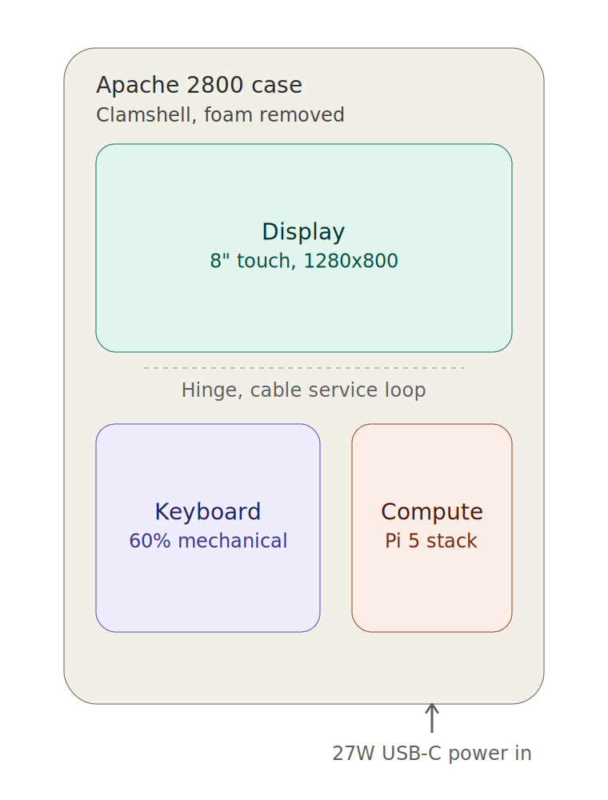

# Chapter 16: Finished Product

**Learning objectives:** See the fully assembled device as a whole — the component layout, a labeled schematic, and an interactive 3D model — before or after working through the build chapters.  
**Tools & materials:** A web browser (for the interactive 3D model). No physical tools required.  
**Estimated time:** 10–15 minutes

## 16.1 Assembled Overview

The finished device has four zones, all covered individually in earlier chapters and brought together here:

- **Case** — the Apache 2800 shell, closed it looks like an unmodified rugged case (Chapter 4.1); open, it functions like a clamshell laptop.
- **Lid** — carries the 8″ Waveshare IPS capacitive touch display (1280×800), mounted flush in the cut opening from Chapter 5, cabled across the hinge with a deliberate service loop (Chapter 6.1, Chapter 7.2).
- **Base, front** — the Razer Huntsman Mini 60% keyboard, mounted per the fastener protocol in Chapter 6.5.
- **Base, rear** — the compute stack: Raspberry Pi 5, M.2 HAT+, NVMe SSD, and the Active Cooler on top, oriented for clear fan intake/exhaust (Chapter 6.6, Chapter 8.2).

Power is single-source: the official 27W USB-C PSU feeds the Pi 5 directly, with no internal battery in this baseline build (Chapter 7.1) — see Chapter 13.1 for the battery upgrade path.

## 16.2 Component Layout Schematic

*The four zones from Section 16.1, shown as a labeled containment diagram: case (outer shell), display (lid), keyboard and compute stack (base), joined at the hinge, with external power entering the compute zone.*

This schematic uses only the components and relationships already documented elsewhere in this manual — nothing here is a new spec. If anything in the diagram conflicts with a build chapter, the build chapter is the correct reference; this is a summary view, not a source of new dimensions.

## 16.3 Interactive 3D Model

A rotatable 3D model of the assembled device is included at [`assets/models/Pi5_Cyberdeck_3D_Model.html`](../../assets/models/Pi5_Cyberdeck_3D_Model.html).

To view it:

1. Download or clone this repository.
2. Open `assets/models/Pi5_Cyberdeck_3D_Model.html` directly in any modern web browser (double-click the file, or drag it into a browser window — no server or install required).
3. Drag to rotate the model manually; release and it auto-spins after a couple of seconds.

What it shows, matching Section 16.1 exactly:

| Model element | Represents |
|---|---|
| Graphite outer shell | Apache 2800 case, including the two side latches |
| Hinged lid, teal-tinted panel | Display mount, opened to a natural viewing angle |
| Purple-tinted block with key grid | 60% keyboard footprint |
| Coral-tinted stacked assembly | Pi 5 board → M.2 HAT+ board → Active Cooler, in that stacking order |

## 16.4 What This Model Deliberately Does Not Show

Consistent with this manual's build philosophy (Chapter 1.9, Chapter 4.2): no exact case interior dimensions, bezel measurements, or standoff lengths are encoded in either the schematic or the 3D model. Both are proportional representations for orientation, not fabrication references. When cutting, measuring, or mounting anything, the authoritative source is always your own calipers against your own physical parts — never a rendered model.

## Chapter Summary

- The finished device resolves to four zones — case, display, keyboard, compute stack — each already fully specified in earlier chapters.
- The schematic and 3D model are summary and orientation tools, not new sources of dimensional truth.
- The 3D model is a standalone HTML file; no build tooling or server is needed to view it.

Cross-references: See Chapter 1.9 for the full capabilities and potential list, Chapter 4 for the real measurement methodology, Chapter 6 for assembly order, Chapter 11 for acceptance testing of the completed device.
